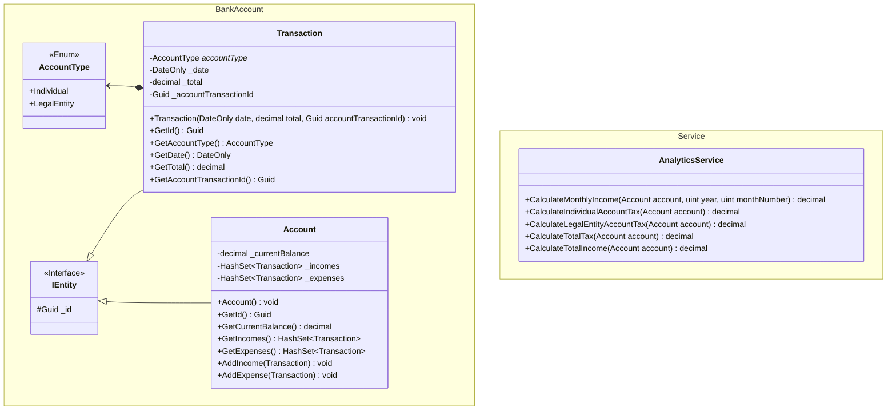

```mermaid
classDiagram
    namespace BankAccount {
        class IEntity {
            <<Interface>>
            #Guid _id
        }

        class AccountType {
            <<Enum>>
            +Individual
            +LegalEntity
        }

        class Transaction {
            -AccountType _accountType_
            -DateOnly _date
            -decimal _total
            -Guid _accountTransactionId
            +Transaction(DateOnly date, decimal total, Guid accountTransactionId) void
            +GetId() Guid
            +GetAccountType() AccountType
            +GetDate() DateOnly
            +GetTotal() decimal
            +GetAccountTransactionId() Guid
        }

        class Account {
            -decimal _currentBalance
            -HashSet~Transaction~ _incomes
            -HashSet~Transaction~ _expenses
            +Account() void
            +GetId() Guid
            +GetCurrentBalance() decimal
            +GetIncomes() HashSet~Transaction~
            +GetExpenses() HashSet~Transaction~
            +AddIncome(Transaction) void
            +AddExpense(Transaction) void
        }
    }
    AccountType <--* Transaction
    IEntity <|-- Transaction
    IEntity <|-- Account


    namespace Service {
        class AnalyticsService {
            +CalculateMonthlyIncome(Account account, uint year, uint monthNumber) decimal
            +CalculateIndividualAccountTax(Account account) decimal
            +CalculateLegalEntityAccountTax(Account account) decimal
            +CalculateTotalTax(Account account) decimal
            +CalculateTotalIncome(Account account) decimal
        }
    }
```
