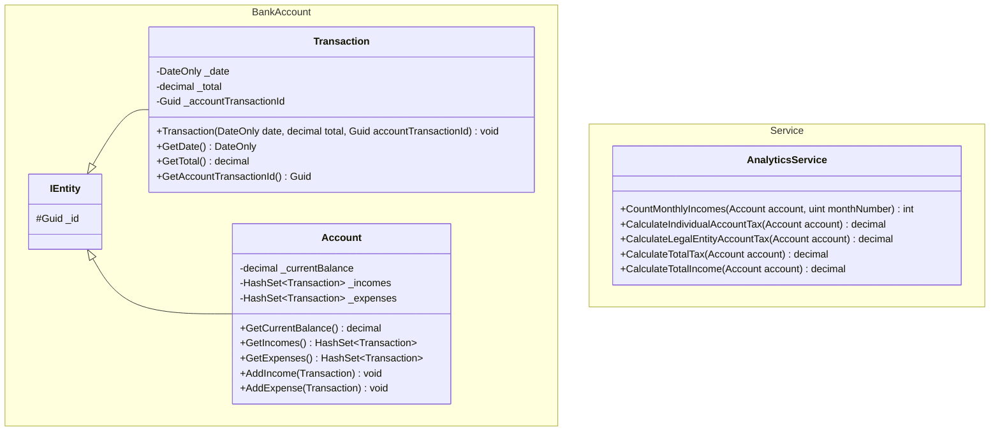

```mermaid
classDiagram
    namespace BankAccount {
    class IEntity {
        #Guid _id
    }

    class Transaction {
        -DateOnly _date
        -decimal _total
        -Guid _accountTransactionId
        +Transaction(DateOnly date, decimal total, Guid accountTransactionId) void
        +GetDate() DateOnly
        +GetTotal() decimal
        +GetAccountTransactionId() Guid
    }

    class Account {
        -decimal _currentBalance
        -HashSet~Transaction~ _incomes
        -HashSet~Transaction~ _expenses
        +GetCurrentBalance() decimal
        +GetIncomes() HashSet~Transaction~
        +GetExpenses() HashSet~Transaction~
        +AddIncome(Transaction) void
        +AddExpense(Transaction) void
    }
    }
    IEntity <|-- Transaction
    IEntity <|-- Account


    namespace Service {
    class AnalyticsService {
        +CountMonthlyIncomes(Account account, uint monthNumber) int
        +CalculateIndividualAccountTax(Account account) decimal
        +CalculateLegalEntityAccountTax(Account account) decimal
        +CalculateTotalTax(Account account) decimal
        +CalculateTotalIncome(Account account) decimal
    }
    }
```
