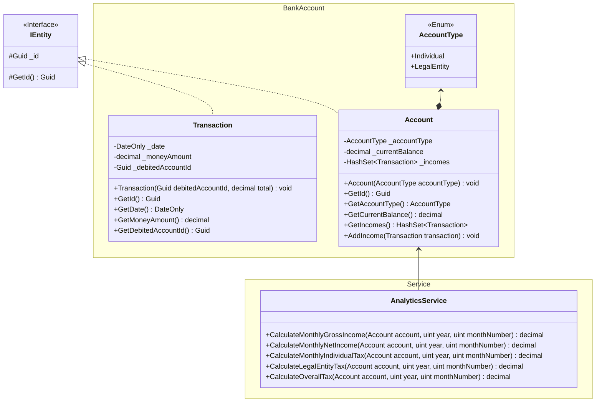

Интерфейс **IEntity** — используется для задания соблюдения контракта у наследника.

Перечисление **AccountType** — используется для задания лица счета.

Класс **Transaction** — используется для создания транзакции дохода или расхода.

Класс **Account** — используется для создания счёта.
Методы:
- **AddIncome(Transaction transaction)** — добавляет доход.
- **AddExpense(Transaction transaction)** — добавляет расход.

Класс **AnalyticsService** — используется для аналитики доходов счёта.
Методы:
- CalculateMonthlyIncome(Account account, uint year, uint monthNumber) — Высчитывает месячный доход без вычета налогов и расходов.
- CalculateIndividualAccountTax(Account account) — Высчитывает налог дохода с физических лиц.
- CalculateLegalEntityAccountTax(Account account) — Высчитывает налог дохода с юридических лиц.
- CalculateTotalTax(Account account) — Высчитывает итоговый налог по доходам с физических и юридических лиц.
- CalculateTotalIncome(Account account) — Высчитывает доход после вычета налогов и расходов.
